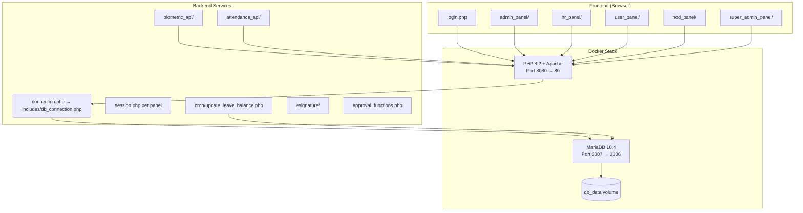
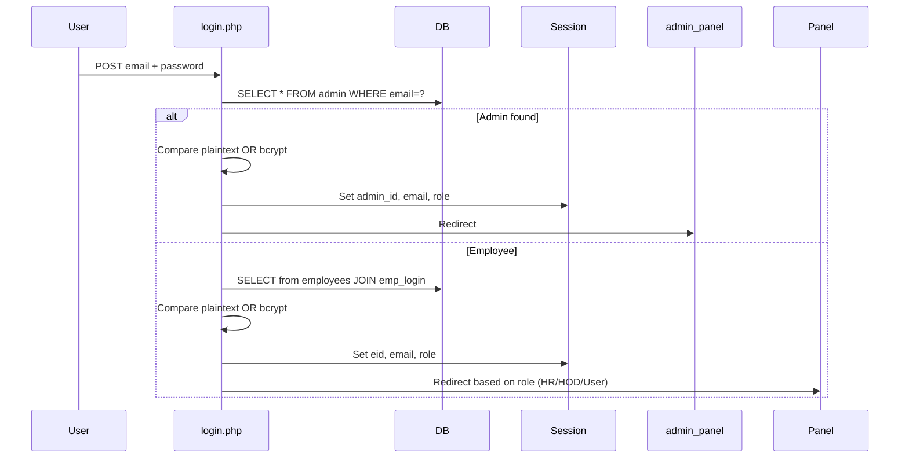

# HRMS Full System Audit — Architecture, Security, Bugs & Fix Plan

> **Production Readiness Score: 28 / 100 — NOT READY FOR PRODUCTION**

---

## PHASE 1: ARCHITECTURE ANALYSIS

### 1.1 Complete Architecture Map



### 1.2 Module Map

| Module | Entry Points | Panel(s) |
|--------|-------------|----------|
| **Authentication** | `login.php`, `forgot_password.php`, `register.php`, `verify_otp.php` | All |
| **Employee Management** | `add_emp.php`, `edit_emp1.php`, `view_emp1.php`, `bulk_upload_emp.php` | Admin, HR, HOD |
| **Attendance** | `manage_attendance.php`, `process_attendance.php`, `upload_attendance.php` | Admin, HR, User |
| **Biometric Integration** | `biometric_api/biometric_sync.php`, `attendance_api/sync.php` | API |
| **Payroll** | `add_sal.php`, `edit_salary.php`, `view_salary.php`, `generate_payslip.php` | Admin, HR |
| **Leave Management** | `user_panel/leave_management/`, `process_leave.php`, `approve_leave.php` | All |
| **E-Signature** | `esignature/` (create, sign, pending, completed, workflow) | Admin, User |
| **Appraisal** | `admin_panel/appraisal/`, `user_panel/appraisal/` | Admin, User |
| **Document Upload** | `document_upload.php`, `update_profile_pic.php` | Admin, HR |
| **PDF/Excel Export** | `generate_payslip.php`, `export_employees.php`, `export_excel.php` | Admin, HR |
| **Access Control** | `access_control.php`, `session.php` (per panel) | Admin |
| **Cron Jobs** | `cron/update_leave_balance.php` | System |

### 1.3 Authentication Flow



### 1.4 How Attendance Affects Payroll

- **Manual process** — payroll is NOT auto-generated from attendance data
- Admin manually enters `present_days`, `leaves`, `lto` in [add_sal.php](file:///c:/Users/Nithish/Desktop/hrms/admin_panel/add_sal.php)
- Leave deduction amounts are manually entered (not calculated from attendance records)
- There is **no automated link** between attendance records and salary deductions
- **Risk**: Attendance data in the `attendance` table is completely disconnected from payroll calculations

### 1.5 How Leave Affects Payroll

- Leave balance is tracked in `employee_leave_balance` table
- Leave requests go through approval workflow (Head → HR)
- Approved leaves are **not** automatically reflected in payroll
- Admin manually enters unpaid leave days and deduction amounts in salary form
- **Risk**: No integrity check between approved leaves and payroll deductions

### 1.6 How Biometric Sync Works

- Two parallel systems exist:
  1. `biometric_api/biometric_sync.php` — Simple API with hardcoded API key (`your_secure_api_key`)
  2. `attendance_api/sync.php` — OOP-based `SyncController` with `BiometricDeviceManager`
- Device sends JSON with staff_code, timestamp, type (IN/OUT)
- Records are inserted into `attendance_logs` table
- **These logs are NOT processed into the main `attendance` table automatically**

### 1.7 How Salary Generation Works

1. Admin selects employee and month in [add_sal.php](file:///c:/Users/Nithish/Desktop/hrms/admin_panel/add_sal.php)
2. Manually enters: base salary, allowances, present days, leaves, deductions
3. System calculates: `gross = base + allowances`, `net = gross - deductions`
4. Duplicate check: prevents same employee + same month
5. PDF payslip generated via mPDF in [generate_payslip.php](file:///c:/Users/Nithish/Desktop/hrms/admin_panel/generate_payslip.php)

---

## PHASE 2 & 3: FULL SYSTEM TESTING + SECURITY AUDIT — FINDINGS

### Issue Severity Legend
- 🔴 **CRITICAL** — Immediate exploitation risk, data breach, financial impact
- 🟠 **HIGH** — Significant security flaw or major functional bug
- 🟡 **MEDIUM** — Moderate risk, should be fixed before production
- 🟢 **LOW** — Minor issue, best-practice violation

---

### 🔴 CRITICAL ISSUES (9)

#### C-01: SQL Injection in Forgot Password
**File**: [forgot_password.php](file:///c:/Users/Nithish/Desktop/hrms/forgot_password.php#L93)
**Root Cause**: Direct string interpolation of user input in SQL query
**Impact**: Full database compromise — attacker can dump all employee data, salaries, passwords
```php
// VULNERABLE (line 93)
$q = "select * from employees where email='$em'";

// Also vulnerable (line 96)
$q1 = "select * from token1 where Email='$em'";

// And (line 106)
$ins_token = "INSERT INTO token1 VALUES ('','$em','$s_time','$token',$otp)";
```

#### C-02: SQL Injection in Leave Processing
**File**: [user_panel/process_leave.php](file:///c:/Users/Nithish/Desktop/hrms/user_panel/process_leave.php#L22-L55)
**Root Cause**: Direct variable interpolation in queries without prepared statements
**Impact**: Employee can manipulate leave records, approve own leaves, access other employees' data
```php
// VULNERABLE (lines 22-24)
$balance_query = "... WHERE elb.emp_id = '$emp_id' AND elb.leave_type = '$leave_type'...";

// VULNERABLE (lines 49-55)
$insert_query = "INSERT INTO leaves (...) VALUES ('$emp_id', '$leave_type', '$start_date', '$end_date', $total_days, '$reason', '$status', '$certificate_path')";

// VULNERABLE (lines 102-106) - Approval queries
$query = "UPDATE leaves SET head_approval = '$status' ... WHERE id = '$leave_id'";
```

#### C-03: SQL Injection in Access Control
**File**: [admin_panel/access_control.php](file:///c:/Users/Nithish/Desktop/hrms/admin_panel/access_control.php#L31-L40)
**Root Cause**: String concatenation with `mysqli_real_escape_string` (insufficient) and raw `$_SESSION` interpolation
**Impact**: Privilege escalation, arbitrary role creation
```php
// VULNERABLE (lines 31-38)
$query = "INSERT INTO access_rights ... VALUES (
    '$role_name', '$department', ..., {$_SESSION['admin_id']})";
```

#### C-04: SQL Injection in Cron Job
**File**: [cron/update_leave_balance.php](file:///c:/Users/Nithish/Desktop/hrms/cron/update_leave_balance.php#L17-L38)
**Root Cause**: All queries use string interpolation from database values
**Impact**: If any `leave_type` value contains SQL metacharacters, arbitrary SQL execution occurs
```php
// VULNERABLE (lines 17-21)
$check_query = "SELECT * FROM employee_leave_balance WHERE emp_id = '{$row['id']}' AND leave_type = '{$row['leave_type']}'...";
```

#### C-05: Passwords Stored in Plaintext & Compared in Plaintext
**File**: [login.php](file:///c:/Users/Nithish/Desktop/hrms/login.php#L37-L43), [admin_panel/change_password.php](file:///c:/Users/Nithish/Desktop/hrms/admin_panel/change_password.php#L7-L26)
**Root Cause**: Login accepts plaintext password comparison. Change password stores passwords in plaintext.
**Impact**: Database breach exposes all user passwords immediately
```php
// login.php line 37 — plaintext comparison
if ($password === $row['password']) { $admin_password_matches = true; }

// change_password.php lines 12-26 — plaintext storage
$query = "SELECT * FROM admin WHERE user_name = ? AND password = ?";
// ...
$update_query = "UPDATE admin SET password = ? WHERE user_name = ?";
// Stores new password as PLAINTEXT (no hashing)
```

#### C-06: Password Change via GET Request — Credentials in URL
**File**: [admin_panel/change_password.php](file:///c:/Users/Nithish/Desktop/hrms/admin_panel/change_password.php#L7-L10)
**Root Cause**: Password change uses GET parameters instead of POST
**Impact**: Passwords logged in server logs, browser history, proxy logs, referer headers
```php
// VULNERABLE — passwords in URL query string
if(isset($_GET['op']) && isset($_GET['np']) && isset($_GET['cp'])) {
    $old_password = $_GET['op'];
    $new_password = $_GET['np'];
```

#### C-07: Zero CSRF Protection Across Entire Application
**Finding**: Zero instances of `csrf_token` found in entire codebase
**Impact**: Any authenticated action (salary creation, leave approval, employee deletion, role changes) can be triggered by a malicious external website

#### C-08: No Session Regeneration After Login
**Finding**: Zero instances of `session_regenerate_id` found in entire codebase
**Impact**: Session fixation attacks possible — attacker can set a session ID before victim logs in, then hijack the session

#### C-09: Hardcoded Database Credentials & API Keys
**Files**: 
- [includes/db_connection.php](file:///c:/Users/Nithish/Desktop/hrms/includes/db_connection.php#L19): `$pass = 'Nizam123$'`
- [config.php](file:///c:/Users/Nithish/Desktop/hrms/config.php#L19-L21): `DB_PASS = ''`
- [config/config.php](file:///c:/Users/Nithish/Desktop/hrms/config/config.php#L29): `DB_PASS = ''`
- [biometric_api/biometric_sync.php](file:///c:/Users/Nithish/Desktop/hrms/biometric_api/biometric_sync.php#L7): `api_key !== 'your_secure_api_key'`
- [approval_functions.php](file:///c:/Users/Nithish/Desktop/hrms/approval_functions.php#L212-L215): SMTP credentials as `'your-email'` / `'your-password'`

---

### 🟠 HIGH ISSUES (14)

#### H-01: XSS via Alert Injection in Login Error
**File**: [login.php](file:///c:/Users/Nithish/Desktop/hrms/login.php#L170)
```php
echo "<script>alert('$login_error');</script>"; // login_error contains user-derived text
```

#### H-02: XSS in Registration Success Message
**File**: [login.php](file:///c:/Users/Nithish/Desktop/hrms/login.php#L159-L163)
```php
alert('" . $_SESSION['message'] . "');  // Unescaped session data in JS
```

#### H-03: Password Logged in Error Logs
**File**: [login.php](file:///c:/Users/Nithish/Desktop/hrms/login.php#L136)
```php
error_log("Password verification failed for employee: " . $email . " | entered:[" . $password . "] stored:[" . $row['password'] . "]");
// Logs BOTH the entered AND stored passwords!
```

#### H-04: No MIME Type Validation on Document Upload
**File**: [admin_panel/document_upload.php](file:///c:/Users/Nithish/Desktop/hrms/admin_panel/document_upload.php#L36-L38)
- Only checks file extension (`$file_ext !== 'pdf'`), no MIME type validation
- A malicious PHP file renamed to `.pdf` extension is blocked, but no `finfo_file()` check exists

#### H-05: Directory Created with 0777 Permissions
**Files**: 
- [document_upload.php](file:///c:/Users/Nithish/Desktop/hrms/admin_panel/document_upload.php#L8): `mkdir($upload_dir, 0777, true)`
- [update_profile_pic.php](file:///c:/Users/Nithish/Desktop/hrms/admin_panel/update_profile_pic.php#L34): `mkdir($upload_dir, 0777, true)`
- [process_leave.php](file:///c:/Users/Nithish/Desktop/hrms/user_panel/process_leave.php#L80): `mkdir($target_dir, 0777, true)`

#### H-06: File Upload — No MIME Validation on Medical Certificates
**File**: [user_panel/process_leave.php](file:///c:/Users/Nithish/Desktop/hrms/user_panel/process_leave.php#L77-L91)
- Allows ANY file type for doctor certificates (no extension or MIME validation)
- Could upload `.php` files as certificates

#### H-07: IDOR — Payslip Generation Without Authorization Check
**File**: [admin_panel/generate_payslip.php](file:///c:/Users/Nithish/Desktop/hrms/admin_panel/generate_payslip.php#L11)
- Uses `download_session.php` instead of `session.php` — unclear if it validates admin role
- Salary ID passed via GET parameter without ownership verification

#### H-08: Admin Session Timeout Logic Bug — Never Fires
**File**: [admin_panel/session.php](file:///c:/Users/Nithish/Desktop/hrms/admin_panel/session.php#L47-L50)
```php
$_SESSION['last_activity'] = time(); // Line 47: UPDATES timestamp
// Line 50: THEN checks if expired — will NEVER expire because we just reset it!
if (isset($_SESSION['last_activity']) && (time() - $_SESSION['last_activity'] > 3600)) {
```

#### H-09: Attendance Double-Bind Bug in Process Attendance
**File**: [user_panel/process_attendance.php](file:///c:/Users/Nithish/Desktop/hrms/user_panel/process_attendance.php#L49-L70)
```php
// First bind_param (line 49) with 8 params
mysqli_stmt_bind_param($stmt, "ssssssss", ...);
// Second bind_param (line 63) with 6 params — OVERWRITES the first!
mysqli_stmt_bind_param($stmt, "ssssss", ...);
// This WILL cause a runtime error — wrong number of params for the query
```

#### H-10: Inconsistent Session Timeout Values
- Admin panel: 3600 seconds (1 hour) — but never fires (see H-08)
- HR panel: 1800 seconds (30 minutes)
- User panel: 3600 seconds (1 hour)
- Docker php.ini: `session.gc_maxlifetime = 1800`

#### H-11: User Panel Session — No Role Verification
**File**: [user_panel/session.php](file:///c:/Users/Nithish/Desktop/hrms/user_panel/session.php#L6)
```php
// Only checks if 'eid' is set — does NOT verify role
if (!isset($_SESSION['eid']) || empty($_SESSION['eid'])) {
// An admin user with 'eid' set could access user panel
// An HR user could access user panel
```

#### H-12: Error Display Enabled in Production
**Files**: Multiple files have `display_errors = 1` including [connection.php](file:///c:/Users/Nithish/Desktop/hrms/connection.php#L20-L21) and [docker/php.ini](file:///c:/Users/Nithish/Desktop/hrms/docker/php.ini#L2)

#### H-13: Hardcoded XAMPP Path in File Proxy
**File**: [file_proxy.php](file:///c:/Users/Nithish/Desktop/hrms/file_proxy.php#L37-L41)
```php
$full_path = 'c:/xampp/htdocs/emps/' . $document['file_path'];
// Breaks in Docker (path is /var/www/html/emps/)
```

#### H-14: Delete Role via GET Without CSRF
**File**: [admin_panel/delete_role.php](file:///c:/Users/Nithish/Desktop/hrms/admin_panel/delete_role.php#L16)
- Destructive action (DELETE) via GET request
- No CSRF token, no confirmation beyond JS `confirm()` which can be bypassed

---

### 🟡 MEDIUM ISSUES (15)

| ID | Issue | File | Description |
|----|-------|------|-------------|
| M-01 | No password complexity requirements | `change_password.php`, `register.php` | Any password accepted |
| M-02 | No brute-force protection on login | `login.php` | No rate limiting or account lockout |
| M-03 | Exposed error logs in webroot | `admin_panel/error.log`, `error_log` | Accessible via browser |
| M-04 | No audit trail for salary modifications | `add_sal.php`, `edit_salary.php` | No log of who changed salary data |
| M-05 | Cookies files committed to repo | `cookies_admin.txt`, `cookies_emp.txt` | Session data in version control |
| M-06 | SQL dump committed to repo | `emps.sql`, `rltnewmd_employees_management.sql` | Contains real data |
| M-07 | Payroll allows negative net salary | `add_sal.php` | No validation that `net_payable >= 0` |
| M-08 | No overlapping leave validation | `process_leave.php` | Can submit overlapping leave dates |
| M-09 | Missing `SameSite` cookie attribute | `docker/php.ini` | Not set, defaults to `Lax` |
| M-10 | Attendance — no duplicate punch protection | `process_attendance.php` | No cooldown between punches |
| M-11 | No attendance locking after payroll | `add_sal.php` | Attendance can be modified after payroll |
| M-12 | `numberToWords` doesn't handle lakhs/crores | `generate_payslip.php` | Overflow for large salaries |
| M-13 | Exposed `.git` directory | Root | Git history potentially browsable |
| M-14 | Multiple jQuery versions loaded | `add_sal.php` | Loads both 3.6.4 and 3.6.0 |
| M-15 | `session.ini` file in webroot | Root | Potential configuration exposure |

---

### 🟢 LOW ISSUES (9)

| ID | Issue | File | Description |
|----|-------|------|-------------|
| L-01 | HTML typo "Deaprtment" | `generate_payslip.php` L346 | Typo on payslip |
| L-02 | Debug/commented code in production | Multiple files | `// echo $link;`, `error_log()` everywhere |
| L-03 | Inconsistent DB name config | `config.php` vs `config/config.php` | `employees_management` vs `emps` vs `EMPS` |
| L-04 | Dead code — `salary-original.php` | Multiple panels | Unused backup files |
| L-05 | Missing `<!DOCTYPE>` in some pages | `process_leave.php` | Mixed HTML structure |
| L-06 | Redundant `session_start()` calls | Admin panel | Called in session.php AND session_manager.php |
| L-07 | Watermark disabled | `generate_payslip.php` L186 | `$mpdf->showWatermarkImage = false;` |
| L-08 | `cron update.txt` has spaces in name | Root | Non-standard file naming |
| L-09 | Super admin panel missing analysis | `super_admin_panel/` | Needs separate audit |

---

## PHASE 4: PERFORMANCE ISSUES

| Issue | Location | Impact |
|-------|----------|--------|
| **N+1 query in manage_attendance** | `manage_attendance.php` L93 | Loads ALL attendance records with no pagination — will crash with thousands of records |
| **No DB indexes apparent** | Attendance, salary queries | Full table scans on `attendance_date`, `emp_id` |
| **Cron CROSS JOIN** | `cron/update_leave_balance.php` L4 | `employees CROSS JOIN leave_policies` generates cartesian product |
| **Sync controller no batching** | `attendance_api/sync.php` L102 | Individual INSERT per record instead of batch |
| **No connection pooling** | `db_connection.php` | Uses static singleton but no persistent connection |
| **Full employee list for dropdowns** | `add_sal.php` L10 | Loads ALL employees into memory for select |

---

## PHASE 5: PROPOSED FIXES (Priority Order)

> [!CAUTION]
> The fixes below are listed in criticality order. I will implement them sequentially after your approval.

### Fix Group 1: Critical Security (C-01 through C-09)

All SQL injection fixes will convert to prepared statements. Password handling will be migrated to `password_hash()`/`password_verify()` only. CSRF tokens will be implemented via a shared `csrf.php` helper. Session regeneration will be added post-login.

### Fix Group 2: High Security (H-01 through H-14)

XSS fixes via `htmlspecialchars()`. Session timeout logic fix. Double-bind bug fix. MIME validation additions. Path corrections for Docker.

### Fix Group 3: Functional Bugs (H-09, M-07, M-08, M-10, M-11)

Attendance processing fix. Payroll validation. Leave overlap check. Duplicate punch prevention.

### Fix Group 4: Performance & Hardening (Phase 4 items + M-series)

Query pagination. Index recommendations. Error display off. Log sanitization.

---

## User Review Required

> [!IMPORTANT]
> **This audit found 47 issues (9 Critical, 14 High, 15 Medium, 9 Low).** The application is NOT production-ready. Several Critical SQL injection vulnerabilities allow full database compromise.

> [!WARNING]
> **Immediate action needed on:** C-05 (plaintext passwords), C-06 (passwords in URLs), C-07 (zero CSRF), C-01/C-02 (SQL injection in public endpoints).

## Open Questions

> [!IMPORTANT]
> 1. **Password Migration Strategy**: There are existing plaintext passwords in the database. Should I create a migration script to hash all existing passwords? This will invalidate plaintext logins permanently.

> [!IMPORTANT]
> 2. **Scope of Fixes**: Should I fix ALL 47 issues in this session, or should I prioritize Critical + High only (23 issues) and leave Medium/Low for a follow-up?

> [!IMPORTANT]  
> 3. **`super_admin_panel/` and `hod_panel/`**: I have not yet deeply audited these panels. Should I include them in the fix scope?

> [!IMPORTANT]
> 4. **Business Logic Concern — Payroll**: The salary system is entirely manual with no connection to attendance data. Is this intentional, or should I propose an automated payroll calculation from attendance records?

> [!IMPORTANT]
> 5. **Biometric API key**: The API key is `'your_secure_api_key'` — a placeholder. Should I generate a real key and put it in environment variables?

---

## Verification Plan

### Automated Tests
- Grep-based verification that zero raw SQL interpolation remains after fixes
- Verify all `password_hash` / `password_verify` usage replaces plaintext
- Verify CSRF token presence in all POST forms
- Verify `session_regenerate_id(true)` in login flow

### Manual Verification
- Test login with existing plaintext passwords (should fail after migration)
- Test CSRF by submitting a form from an external origin
- Test SQL injection on `forgot_password.php` after fix
- Test file upload with `.php` file renamed to `.pdf`
- Test session timeout by waiting >30 minutes
- Test payslip generation for salary > 99,999 AED (numberToWords overflow)
- Verify Docker containers start correctly after all changes
